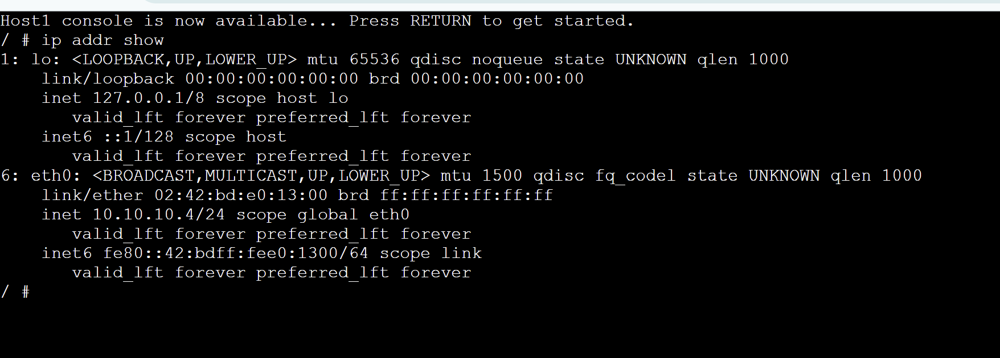

### Week 01 Portfolio – GNS3 Basics
Name: Harsha Vardhan Rayi
Student ID: 12307204
Unit: COIT20261
Date: 17/04/2026
### Task Summary

This week focused on learning the basics of GNS3 including:
Creating a project
Adding a Linux host
Configuring static IP
Using Linux commands

### Screenshots

