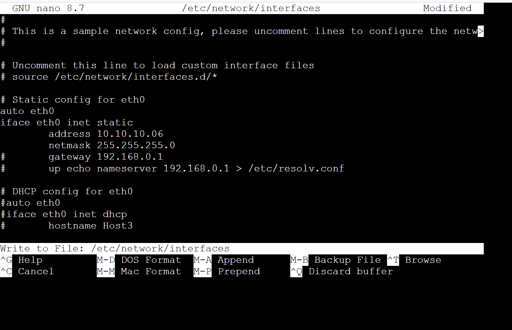
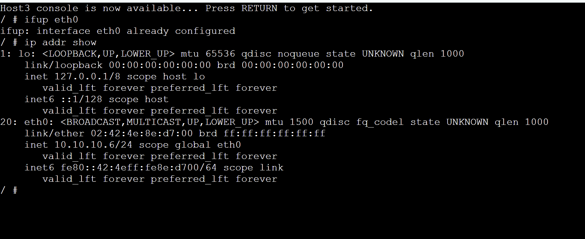
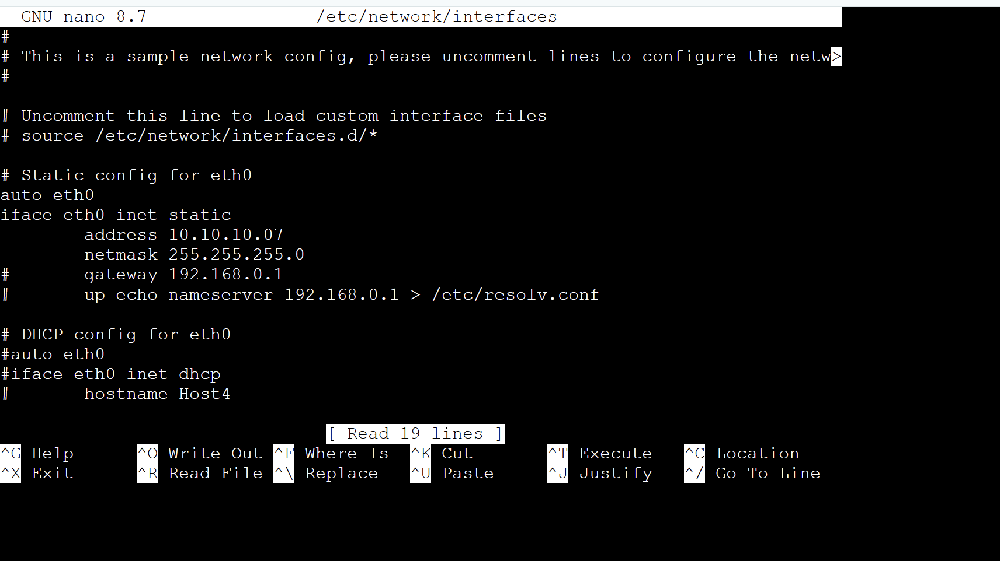
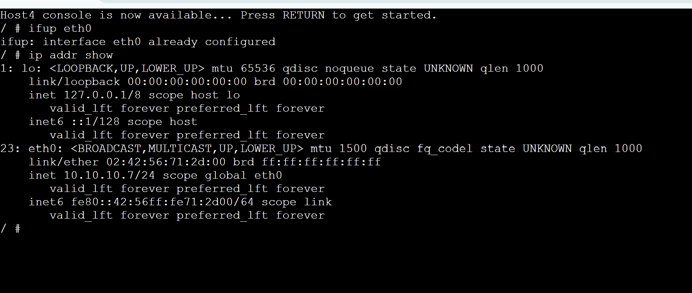
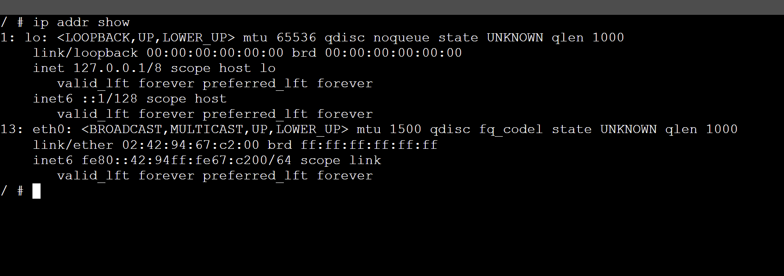
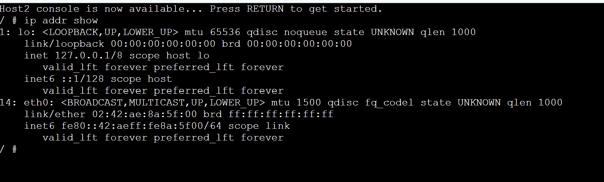
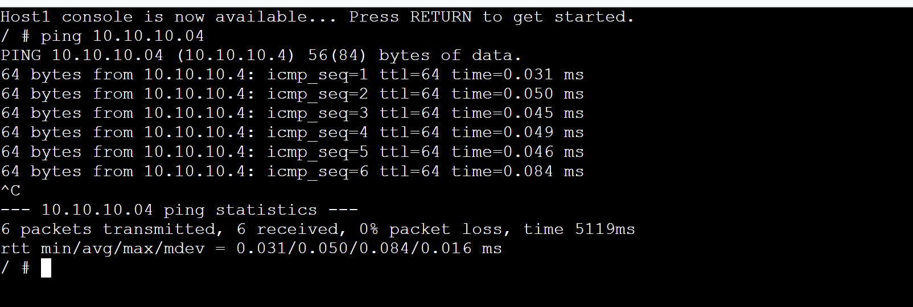
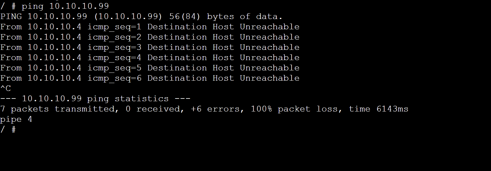
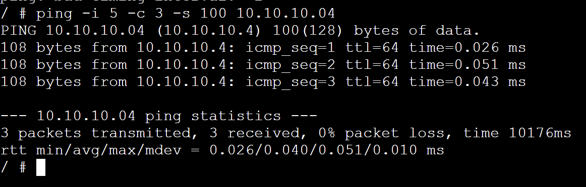
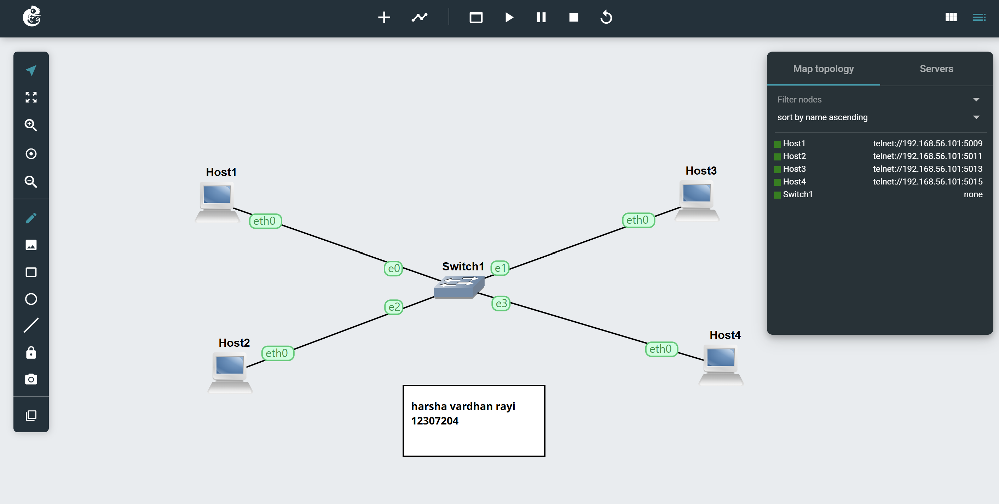

# Week 02 Tutorial – COIT20261

### 👨‍💻 Student Details
- Name: Harsha Vardhan Rayi
- Student ID: 12307204
  
---

### Task 1: Setting Static IP Addresses

### Methods Used:
1. GNS3 Configure Menu (Host 1 & Host 2)
2. /etc/network/interfaces (Host 3)
3. ip command (Host 4)

### Network Used:
10.10.10.04/24

### Example IP Allocation:
- Host1 → 10.10.10.04
- Host2 → 10.10.10.05
- Host3 → 10.10.10.06
- Host4 → 10.10.10.07

---

### Task 1: Show IP address 

### Task 2: Ping Testing

