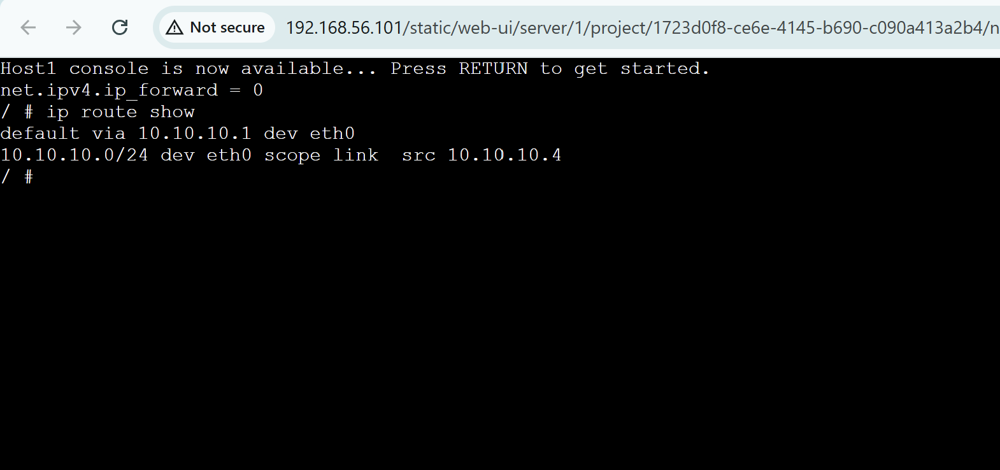
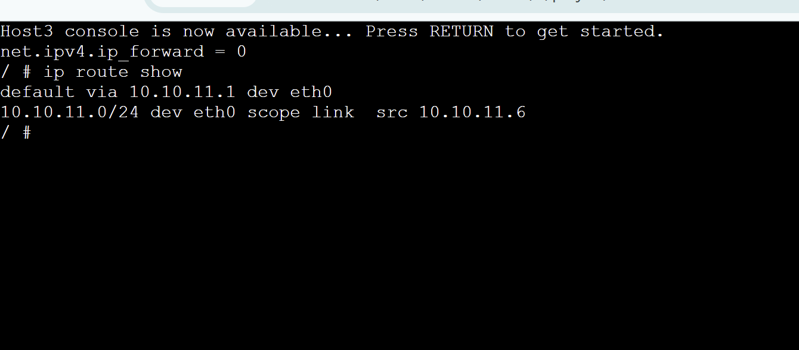
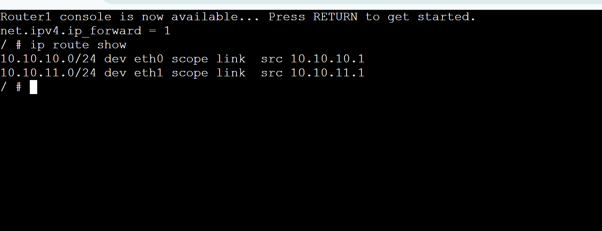
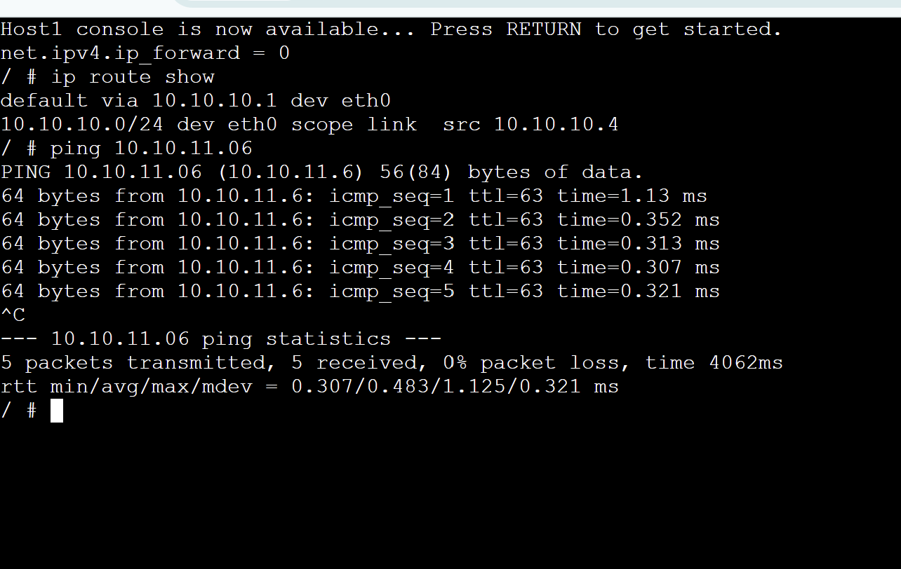
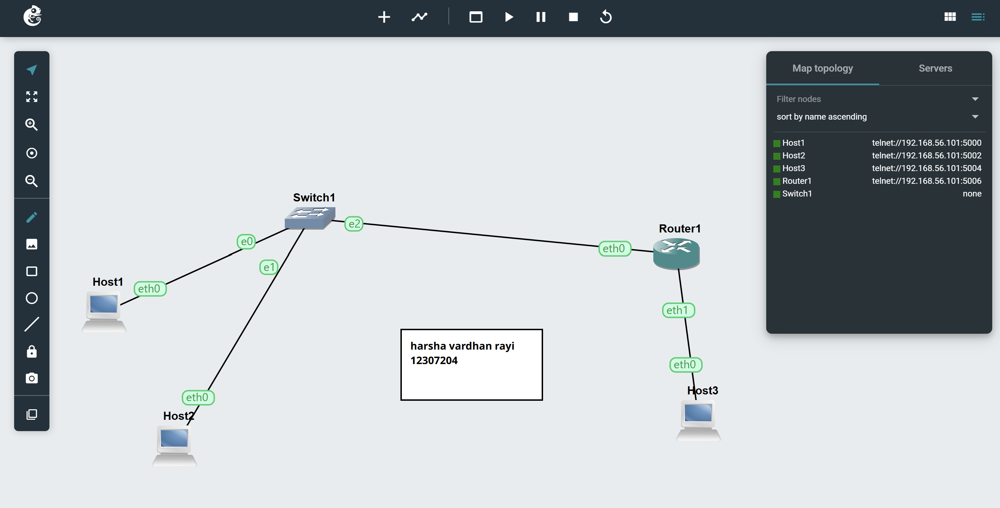
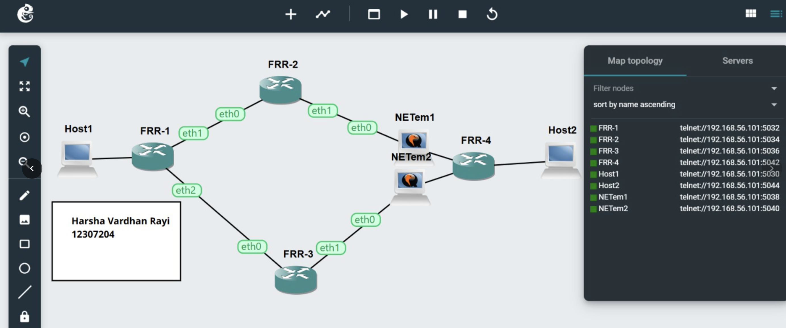

#  Week 04 Tutorial – Networking (GNS3)

##  Task 1: View Routing Tables

###  Aim
Learn how to view routing tables and enable forwarding on a router.

---

###  Network Topology
- 3 Linux Hosts (Host1, Host2, Host3)
- 1 Linux Router
- 1 Ethernet Switch
- 2 Subnets:
  - `10.10.10.1/24`
  - `10.10.11.1/24`

---

###  IP Address Configuration

| Device | Interface | IP Address | Netmask | Gateway |
|--------|----------|------------|---------|---------|
| Host1  | eth0     | 10.10.10.04   | 255.255.255.0 | 10.10.10.1 |
| Host2  | eth0     | 10.10.10.05   | 255.255.255.0 | 10.10.10.1 |
| Router | eth0     | 10.10.10.1   | 255.255.255.0 | - |
| Router | eth1     | 10.10.11.1   | 255.255.255.0 | - |
| Host3  | eth0     | 10.10.11.2   | 255.255.255.0 | 10.10.11.1 |

---

### Configuration Example

#### Host Configuration
bash

auto eth0

iface eth0 inet static
  
   address 10.10.10.04
   
   netmask 255.255.255.0
   
   gateway 10.10.10.1
   
   up sysctl net.ipv4.ip_forward=0
#### Router Configuration

auto eth0

iface eth0 inet static

   address 10.1.1.1
   
   netmask 255.255.255.0

auto eth1

iface eth1 inet static

   address 10.1.2.1
   
   netmask 255.255.255.0

up sysctl net.ipv4.ip_forward=1

## Screenshots of route tables:

## Task 2:

