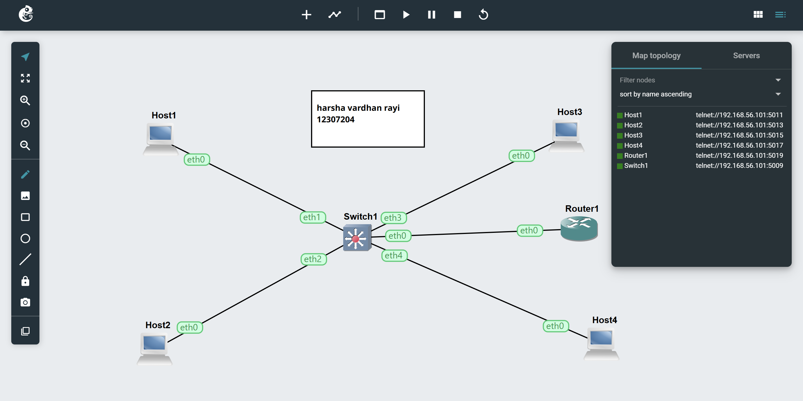

# 🖧 VLAN Basics using OpenvSwitch (GNS3)

## 📌 Aim
To learn how to configure Virtual LANs (VLANs) on a managed switch using OpenvSwitch in GNS3 and understand network segmentation.

---

## 🛠️ Topology
- 4 × Linux Hosts  
- 1 × OpenvSwitch  
- Connections:
  - Host1 → eth1  
  - Host2 → eth2  
  - Host3 → eth3  
  - Host4 → eth4  
- Note: eth0 is unused in this task

---

## 🌐 IP Configuration
All hosts are configured in the same subnet:

| Host   | IP Address        |
|--------|------------------|
| Host1  | 10.10.10.04/24   |
| Host2  | 10.10.10.05/24   |
| Host3  | 10.10.10.06/24   |
| Host4  | 10.10.10.07/24   |

---

## ▶️ Initial Connectivity Test
Before VLAN configuration, all hosts can communicate:

```bash
ping 10.10.10.05
ping 10.10.10.06
ping 10.10.10.07
```
### VLAN Configuration

VLANs are configured on the OpenvSwitch using the following commands:


ovs-vsctl set port eth1 tag=04

ovs-vsctl set port eth2 tag=04

ovs-vsctl set port eth3 tag=05

ovs-vsctl set port eth4 tag=05

VLAN Assignment:

VLAN 04 → Host1, Host2

VLAN 05 → Host3, Host4
### Observations
VLANs divide a single physical network into multiple logical networks.

Devices in different VLANs cannot communicate without routing.

Broadcast traffic is limited within each VLAN.
### Conclusion

This experiment demonstrates how VLANs improve network segmentation, security, and efficiency by isolating traffic within specific groups of devices.



