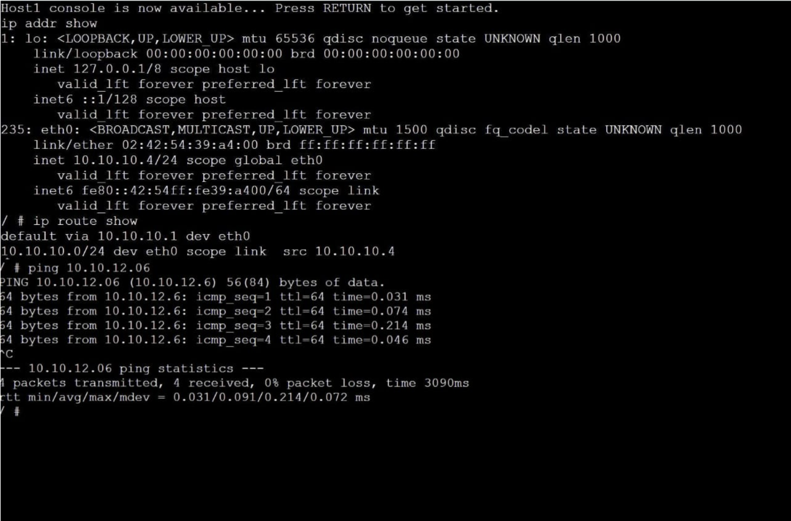

# Task 1: Resolving IP Addresses to Hardware Addresses (ARP)

## Aim
To understand how ARP (Address Resolution Protocol) maps IP addresses to MAC (hardware) addresses in a Local Area Network (LAN).

---

##  Setup
- Project Name: `ARP-Basics-<studentid>`
- Devices Used:
  - 4 Linux Hosts (Host A, Host B, Host C, Host D)
  - 1 Ethernet Switch
- Ensure all hosts are assigned IP addresses.

---

##  Steps

### 1. View ARP Table on Host A
Run the following command on Host A:

```bash
ip neigh show
```
### 2. Ping Host B from Host A
ping <HostB-IP>
### 3. View ARP Table Again on Host A
ip neigh show
#### Observation:

A new entry for Host B will appear
It shows:
IP address
MAC address
State (REACHABLE or stale)
### 4. Ping Host A from Host C
ping <HostA-IP>
### 5. View ARP Table Again on Host A
ip neigh show
#### Observation:

Additional entries are added
ARP table updates dynamically as communication occurs
#### Explanation
ARP (Address Resolution Protocol) is used to map an IP address to a MAC address.
When a device wants to communicate:
It sends an ARP request
The destination replies with its MAC address
The mapping is stored in the ARP table
Entries may expire if not used for some time.
### Output



